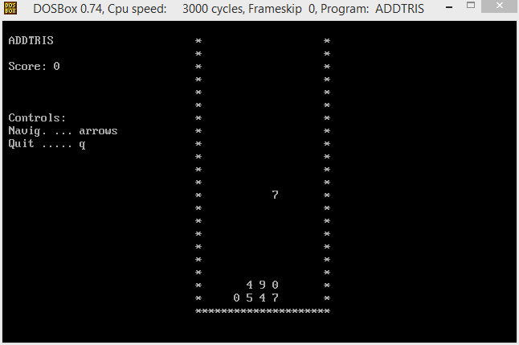

# Addtris

The target of Addtris game is to put number above two others so that value of number at the top is sum of two underlying. If the sum of two lower is for example 14 you should put 4 above them.  
  
For controls use arrows. By arrow up you can change value of falling number as to be completion to 10.

